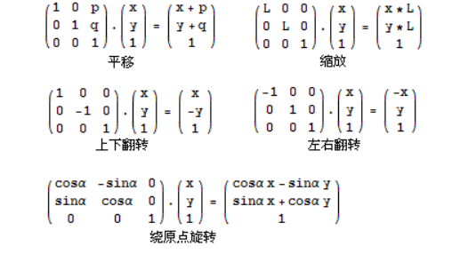

# 题目
链接：[http://acm.nyist.net/JudgeOnline/problem.php?pid=298](http://acm.nyist.net/JudgeOnline/problem.php?pid=298)
# 题意
给你一个平面图，n个点，m次操作。操作有平移、缩放、翻转和旋转。
# 方法
以平常的方法肯定超时，所以需要把所有操作化为一个矩阵，然后遍历这些点就可以了。
但是我犯了一个很重要的错误，那就是在把所有矩阵化为一个矩阵时，乘反了，应该把操作那个矩阵放前面，我也不知道为什么，求解答。

<!--more-->
# 代码
 ````c++
#include<stdio.h>
#include<math.h>
#include<string.h>
#include<iostream>
#include<algorithm>
using namespace std;
#define PI acos(-1.0)
const int maxx=3;
struct mat
{
    double m[maxx][maxx];
};
mat I;
mat ans;
double x[10005];
double y[10005];
mat mul(mat a,mat b)
{
    mat c;
    for(int i=0; i<3; i++)
    {
        for(int j=0; j<3; j++)
        {
            c.m[i][j]=0;
            for(int k=0; k<3; k++)
            {
                c.m[i][j]+=(a.m[i][k]*b.m[k][j]);
            }
        }
    }
    return c;
}
int main()
{
    int n,m;
    while(~scanf("%d%d",&n,&m))
    {
        for(int i=0; i<n; i++)
        {
            scanf("%lf%lf",&x[i],&y[i]);
        }
        for(int i=0;i<3;i++)
            for(int j=0;j<3;j++)
            i==j?ans.m[i][j]=1:ans.m[i][j]=0;
        for(int i=0; i<m; i++)
        {
            memset(I.m,0,sizeof(I.m));
            getchar();
            char a;
            scanf("%c",&a);
            if(a=='X')
            {
                I.m[0][0]=1.0;
                I.m[1][1]=-1.0;
                I.m[2][2]=1.0;
            }
            else if(a=='Y')
            {
                I.m[0][0]=-1.0;
                I.m[1][1]=1.0;
                I.m[2][2]=1.0;
            }
            else if(a=='M')
            {
                double p,q;
                scanf("%lf%lf",&p,&q);
                I.m[0][0]=1.0;
                I.m[1][1]=1.0;
                I.m[2][2]=1.0;
                I.m[0][2]=p;
                I.m[1][2]=q;
            }
            else if(a=='S')
            {
                double p;
                scanf("%lf",&p);
                I.m[0][0]=p;
                I.m[1][1]=p;
                I.m[2][2]=1.0;
            }
            else if(a=='R')
            {
                double p;
                scanf("%lf",&p);
                I.m[0][0]=cos(PI*p/180.0);
                I.m[0][1]=-sin(PI*p/180.0);
                I.m[1][0]=sin(PI*p/180.0);
                I.m[1][1]=cos(PI*p/180.0);
                I.m[2][2]=1.0;
            }
            ans=mul(I,ans);//不太明白为什么要把I放在前面，但必需放前面，不然就会错。
        }
        for(int i=0; i<n; i++)
        {
            memset(I.m,0,sizeof(I.m));
            I.m[0][0]=x[i];
            I.m[1][0]=y[i];
            I.m[2][0]=1;
            I=mul(ans,I);
            printf("%.1lf %.1lf\n",I.m[0][0],I.m[1][0]);
        }
    }
    return 0;
}


    ````