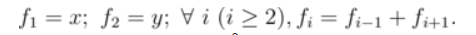
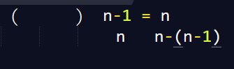

# 题目
链接：[http://codeforces.com/contest/450/problem/B](http://codeforces.com/contest/450/problem/B)
# 题意
给你一个数学公式

稍微推导一下，发现是Fibonacci，那么就利用到我们矩阵十大经典题型的第六题，构造一个矩阵，使得

一个矩阵乘以2乘1的矩阵得到一个2乘1的矩阵如上图。
这个矩阵就是这样
 ````c++
 0 1
-1 1
    ````
然后n-2次快速幂即可，但是要注意输出的为负数是要+MOD然后%MOD。
<!--more-->
# 代码
 ````c++
#include<stdio.h>
#include<string.h>
#include<string>
#include<iostream>
#include<algorithm>
using namespace std;
#define LL long long
const int inf=0x3f3f3f3f;
const int MOD=1e9+7;
int x,y,n;
struct mat
{
    int m[2][2];
};
mat ans=
{
    0,1,
    -1,1
};
mat res=
{
    1,0,
    0,1
};
mat mul(mat a,mat b)
{
    mat c;
    for(int i=0;i<2;i++)
    {
        for(int j=0;j<2;j++)
        {
            c.m[i][j]=0;
            for(int k=0;k<2;k++)
            {
                c.m[i][j]+=a.m[i][k]*b.m[k][j];
                c.m[i][j]%=MOD;
            }
        }
    }
    return c;
}
mat quick(mat a,int k)
{
    mat p=res;
    while(k>0)
    {
        if(k&1)
            p=mul(p,a);
        a=mul(a,a);
        k>>=1;
    }
    return p;
}
int main()
{
    while(~scanf("%d%d",&x,&y))
    {
        scanf("%d",&n);
        if(n==1)
            printf("%d\n",(x+MOD)%MOD);
        else if(n==2)
            printf("%d\n",(y+MOD)%MOD);
        else
        {
            mat q=quick(ans,n-2);
            mat z;
            z.m[0][0]=0;
            z.m[1][0]=0;
            z.m[0][1]=x;
            z.m[1][1]=y;
            q=mul(q,z);
            printf("%d\n",(q.m[1][1]+MOD)%MOD);
        }
    }
    return 0;
}

    ````