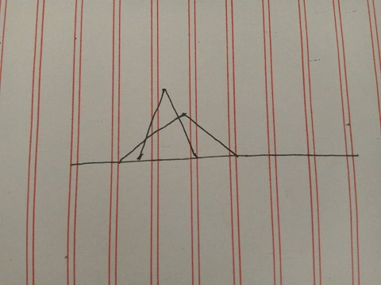

Description

Assume the coasting is an infinite straight line. Land is in one side of coasting, sea in the other. Each small island is a point locating in the sea side. And any radar installation, locating on the coasting, can only cover d distance, so an island in the sea can be covered by a radius installation, if the distance between them is at most d. 

We use Cartesian coordinate system, defining the coasting is the x-axis. The sea side is above x-axis, and the land side below. Given the position of each island in the sea, and given the distance of the coverage of the radar installation, your task is to write a program to find the minimal number of radar installations to cover all the islands. Note that the position of an island is represented by its x-y coordinates. 

Figure A Sample Input of Radar Installations

Input

The input consists of several test cases. The first line of each case contains two integers n (1<=n<=1000) and d, where n is the number of islands in the sea and d is the distance of coverage of the radar installation. This is followed by n lines each containing two integers representing the coordinate of the position of each island. Then a blank line follows to separate the cases. 

The input is terminated by a line containing pair of zeros 
Output

For each test case output one line consisting of the test case number followed by the minimal number of radar installations needed. "-1" installation means no solution for that case.
Sample Input

3 2
1 2
-3 1
2 1

1 2
0 2

0 0
Sample Output

Case 1: 2
Case 2: 1

题意：x轴是海岸线，上方是海平面，下方是陆地，点是岛，求在海岸线布置最少的雷达覆盖所有的岛。
做法：把每个岛在岸上对应的区间求出，并从小到大排序。
    ````
                if(num[i].y<temp)
                    temp=num[i].y;
    ````
这段代码的意义就是这个图



  ````c++
#include<stdio.h>
#include<math.h>
#include<queue>
#include<string>
#include<string.h>
#include<iostream>
#include<algorithm>
using namespace std;
#define inf 0x3f3f3f3f;
struct node
{
    double x,y;
} num[1005];
bool cmp(node x,node y)
{
    return x.x<y.x;
}
int main()
{
    int n;
    double d;
    int tt=1;
    while(~scanf("%d%lf",&n,&d))
    {
        if(n==0&&d==0)
            return 0;
        double maxx=-inf;
        for(int i=0; i<n; i++)
        {
            double a,b;
            scanf("%lf%lf",&a,&b);
            maxx=max(maxx,b);
            num[i].x=1.0*a-sqrt(1.0*d*d-1.0*b*b);
            num[i].y=1.0*a+sqrt(1.0*d*d-1.0*b*b);
        }
        if(maxx>d)
            printf("Case %d: -1\n",tt++);
        else
        {
            int sum=1;
            sort(num,num+n,cmp);
            double temp=num[0].y;
            for(int i=1; i<n; i++)
            {
                if(num[i].y<temp)//为什么有这一步，排完序后，还存在这种点（）
                    temp=num[i].y;
                if(temp<num[i].x)
                {
                    sum++;
                    temp=num[i].y;
                }
            }
            printf("Case %d: %d\n",tt++,sum);
        }
    }
    return 0;
}
    ````