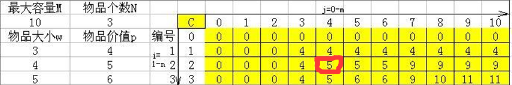
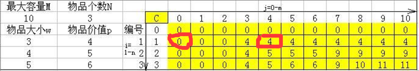

A - Charm Bracelet
Time Limit:1000MS     Memory Limit:65536KB     64bit IO Format:%I64d & %I64u
Submit
 
Status
Description
Bessie has gone to the mall's jewelry store and spies a charm bracelet. Of course, she'd like to fill it with the best charms possible from the N (1 ≤ N ≤ 3,402) available charms. Each charm i in the supplied list has a weight Wi (1 ≤ Wi ≤ 400), a 'desirability' factor Di (1 ≤ Di ≤ 100), and can be used at most once. Bessie can only support a charm bracelet whose weight is no more than M (1 ≤ M ≤ 12,880).

Given that weight limit as a constraint and a list of the charms with their weights and desirability rating, deduce the maximum possible sum of ratings.

Input
* Line 1: Two space-separated integers: N and M
* Lines 2..N+1: Line i+1 describes charm i with two space-separated integers: Wi and Di

Output
* Line 1: A single integer that is the greatest sum of charm desirabilities that can be achieved given the weight constraints

Sample Input
4 6
1 4
2 6
3 12
2 7
Sample Output
23

题意：给出个数n，体积vi，每个所占体积，每个所具有的价值，求在体积满足条件基础上求出价值最大值。
做法：入门dp的01背包问题，以前不怎么清楚，今天仔细想了一下。
举个例子：
   w v
1  3 4
2  4 5

给出这两个物品，假如体积为3，那么你肯定装1，因为只能装入1，这就像dp中的这一步

当体积增加为4时，装2，因为这句话f[i][v]=max{f[i-1][v],f[i-1][v-c[i]]+w[i]}
那就相当于这一步,0+5和4比较

当体积增加到7时，那么两个就都能装下。
所以dp-01背包就是这个意思。从装第一个物品开始，判断能不能装下，不能就继承上一个状态，如果能那就比较一下装与不装哪个更优，不装就是这个状态f[i-1][v]，装就是这样f[i-1][v-c[i]]+w[i]，装为什么从这开始？
我想的是假如有另外vi个篮子，体积从0开始换篮子，当不能装下这个物品时就继承前面的状态，当增大到能装下就装下，与前面哪个体积一样的比较，看看哪个大就继承下来，所以到最后一定是最大的价值。
二维数组转化为一位就不是说了，很好理解。
  ````c++
#include<stdio.h>
#include<math.h>
#include<queue>
#include<string>
#include<string.h>
#include<iostream>
#include<algorithm>
#include<map>
using namespace std;
const int inf=0x3f3f3f3f;
int f[60000];
int w[60000],v[60000];
int main()
{
    int n,vi;
    while(~scanf("%d%d",&n,&vi))
    {
        for(int i=1;i<=n;i++)
            scanf("%d%d",&w[i],&v[i]);
        for(int i=1;i<=n;i++)
        {
            for(int j=vi;j>=w[i];j--)
            {
                f[j]=max(f[j],f[j-w[i]]+v[i]);
            }
        }
        printf("%d\n",f[vi]);
    }
    return 0;
}
    ````