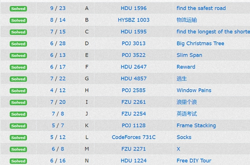

# 题目
链接：[http://poj.org/problem?id=1128](http://poj.org/problem?id=1128)
# 题意
给几张图，对齐随意叠放，求叠放顺序
# 方法
拓扑排序+dfs
Now place them on top of one another starting with 1 at the bottom and ending up with 5 on top，根据这句话可以构建顺序来排序，具体一点就是先确定一个图形字母的左上点和右下点，然后遍历边框，这样就可以排出顺序。
因为有可能有多种情况，dfs输出，dfs就像平行世界一样，好好玩，想想很有趣！！！
<!--more-->
图论题终于补完了，
# 代码
  ````c++
#include<stdio.h>
#include<string>
#include<string.h>
#include<queue>
#include<stack>
#include<map>
#include<iostream>
#include<algorithm>
using namespace std;
const int inf=0x3f3f3f3f;
int n,m;
char mapp[30][30];
int d[30],tot;//深度和字母数量
int g[30][30];
char ans[30];
struct node
{
    int x,y;

} minn[30],maxx[30];
void init()
{
    tot=0;
    memset(d,-1,sizeof(d));
    for(int i=0; i<n; i++)
    {
        for(int j=0; j<m; j++)
        {
            if(mapp[i][j]=='.') continue;
            //printf("%c ",mapp[i][j]);
            int p=mapp[i][j]-'A';
            if(d[p]==-1)
            {
                tot++;
                minn[p].x=i;
                minn[p].y=j;
                maxx[p].x=i;
                maxx[p].y=j;
                d[p]=0;
            }
            else
            {
                minn[p].x=min(minn[p].x,i);
                minn[p].y=min(minn[p].y,j);
                maxx[p].x=max(maxx[p].x,i);
                maxx[p].y=max(maxx[p].y,j);
            }
        }
    }
}
void tuosort()
{
    memset(g,0,sizeof(g));
    for(int k=0; k<26; k++)
    {
        if(d[k]==-1) continue;
        for(int i=minn[k].x; i<=maxx[k].x; i++)
        {
            for(int j=minn[k].y; j<=maxx[k].y; j++)
            {
                if(minn[k].x<i&&i<maxx[k].x&&minn[k].y<j&&j<maxx[k].y) continue;
                //printf("%d %d\n",i,j);
                if(mapp[i][j]=='.') continue;
                int p=mapp[i][j]-'A';
                if(p!=k&&!g[k][p])
                {
                    g[k][p]=1;
                    d[p]++;
                }
            }
        }
    }
//    for(int i=0;i<5;i++)
//        printf("%d ",d[i]);
//    printf("\n");
}
void dfs(int step)
{
    if(step==tot)
    {
        //ans[step]='\n';
        puts(ans);
        return ;
    }
    for(int i=0; i<30; i++)
    {
        if(d[i]==0)
        {
            ans[step]='A'+i;
            d[i]=-1;
            for(int j=0; j<30; j++)
            {
                if(g[i][j])
                {
                    d[j]--;
                }
            }
            dfs(step+1);
            d[i]=0;
            for(int j=0; j<30; j++)
            {
                if(g[i][j])
                {
                    d[j]++;
                }
            }
        }
    }
}
int main()
{
    while(~scanf("%d%d",&n,&m))
    {
        memset(ans,0,sizeof(ans));
        memset(mapp,0,sizeof(mapp));
        getchar();
        for(int i=0; i<n; i++)
            gets(mapp[i]);
        init();
        tuosort();
        dfs(0);
    }
    return 0;
}
    ````