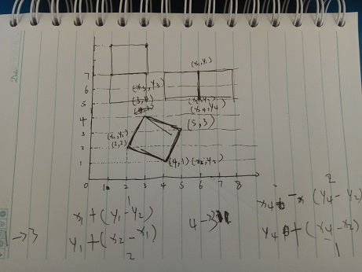

# 题目
链接：[http://acm.hdu.edu.cn/showproblem.php?pid=6055](http://acm.hdu.edu.cn/showproblem.php?pid=6055)
# 题意
给出n组整数，一组代表一个点，求能组成多少正多边形。
# 做法
因为是整数，所以只能形成正方形。

所以先找到两个点，然后判断能形成正方形的另外两个点是否存在，最后/4去重即可。
ps1:本来还想用斜率求点，哎。。。。
ps2:别人的代码不一定好理解，有思路，自己写代码更好
<!--more-->
# 代码
 ````c++
#include<cstdio>
#include<cstring>
#include<math.h>
#include<iostream>
#include<algorithm>
using namespace std;
#define LL long long
const int N=2000;
int x[N],y[N];
int zz[N][N];
int n;
int sum;
void gg(int x1,int y1,int x2,int y2)
{
    if(y1==y2)
    {
        int q=abs(x2-x1);
        if((zz[x1][y1+q]==1)&&(zz[x2][y2+q]==1))
            sum++;
        if((zz[x1][y1-q]==1)&&(zz[x2][y2-q]==1))
            sum++;
    }
    else if(x1==x2)
    {
        int p=abs(y2-y1);
        if((zz[x1+p][y1]==1)&&(zz[x2+p][y2]==1))
            sum++;
        if((zz[x1-p][y1]==1)&&(zz[x2-p][y2]==1))
            sum++;
    }
    else if(((x1<x2)&&(y1>y2))||((x1>x2)&&(y1<y2)))
    {
        int p=abs(y1-y2);
        int q=abs(x2-x1);
        if((zz[x1+p][y1+q]==1)&&(zz[x2+p][y2+q]==1))
            sum++;
        if((zz[x1-p][y1-q]==1)&&(zz[x2-p][y2-q]==1))
            sum++;
    }
    else if(((x1<x2)&&(y1<y2))||((x1>x2)&&(y1>y2)))
    {
        int p=abs(y1-y2);
        int q=abs(x2-x1);
        if((zz[x1-p][y1+q]==1)&&(zz[x2-p][y2+q]==1))
            sum++;
        if((zz[x1+p][y1-q]==1)&&(zz[x2+p][y2-q]==1))
            sum++;
    }
}
int main()
{
    while(~scanf("%d",&n))
    {
        memset(x,0,sizeof(x));
        memset(y,0,sizeof(y));
        memset(zz,0,sizeof(zz));
        sum=0;
        for(int i=0; i<n; i++)
        {
            int a,b;
            scanf("%d%d",&a,&b);
            x[i]=a+500;
            y[i]=b+500;
            zz[a+500][b+500]=1;
        }
        //scanf("%d%d",&x[i],&y[i]);
        for(int i=0; i<n; i++)
        {
            for(int j=i+1; j<n; j++)
            {
                gg(x[i],y[i],x[j],y[j]);
            }
        }
        printf("%d\n",sum/4);
    }
    return 0;
}
/*
4
2 2
4 1
3 4
5 3
*/

    ````